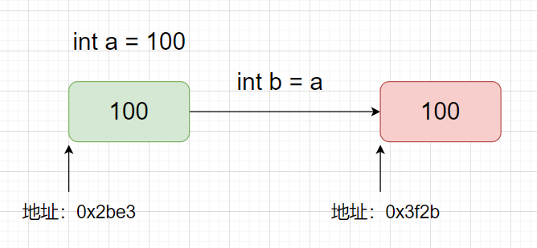
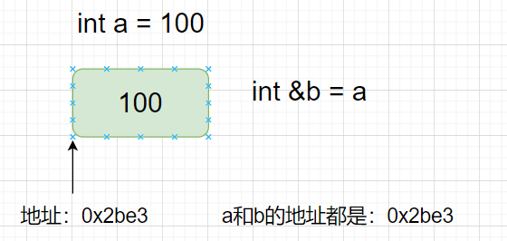

<!--
 * @Author: EST 363023987@qq.com
 * @Date: 2025-05-30 15:34:30
 * @LastEditors: EST 363023987@qq.com
 * @LastEditTime: 2025-06-05 23:38:01
-->
- [变量和输入输出](#变量和输入输出)
  - [变量](#变量)
    - [变量的理解](#变量的理解)
    - [变量的定义与初始化](#变量的定义与初始化)
    - [命名规则](#命名规则)
    - [数据类型的分类](#数据类型的分类)
  - [输入输出](#输入输出)
- [类型转换](#类型转换)
- [作用域](#作用域)
- [内存的使用划分](#内存的使用划分)
- [生成过程](#生成过程)
- [复合类型](#复合类型)
  - [类型说明](#类型说明)
  - [引用](#引用)
  - [左值引用与右值引用](#左值引用与右值引用)
  - [指针](#指针)
    - [指针基础](#指针基础)
    - [指针运算](#指针运算)
  - [const关键字](#const关键字)
  - [constexpr和常量表达式](#constexpr和常量表达式)
- [类型推导和类型别名](#类型推导和类型别名)
  - [类型别名](#类型别名)
  - [类型推导](#类型推导)
    - [auto](#auto)
    - [decltype类型指示符](#decltype类型指示符)
- [智能指针](#智能指针)
  - [unique\_ptr](#unique_ptr)
  - [shared\_ptr](#shared_ptr)
  - [weak\_ptr](#weak_ptr)
  - [自定义销毁](#自定义销毁)
- [lambda和function](#lambda和function)
  - [函数指针](#函数指针)
  - [仿函数](#仿函数)
  - [lambda表达式](#lambda表达式)
  - [std::function](#stdfunction)
  - [std::bind](#stdbind)
  - [总结可调用对象类型](#总结可调用对象类型)
- [模板编程](#模板编程)
  - [函数模板](#函数模板)
  - [类模板](#类模板)
  - [模板参数](#模板参数)
    - [类型参数](#类型参数)
    - [非类型参数](#非类型参数)
    - [模板模板参数](#模板模板参数)
  - [模板特化](#模板特化)
    - [全特化](#全特化)
    - [偏特化](#偏特化)
    - [函数模板的特化](#函数模板的特化)
    - [特化总结](#特化总结)
  - [变参模板](#变参模板)
  - [模板折叠](#模板折叠)
    - [一元折叠表达式](#一元折叠表达式)
    - [二元折叠表达式](#二元折叠表达式)
    - [左折叠和右折叠](#左折叠和右折叠)
    - [`op`在折叠表达式中的作用](#op在折叠表达式中的作用)
    - [使用时的注意事项](#使用时的注意事项)
  - [SFINAE](#sfinae)
    - [基本用法](#基本用法)
    - [优缺点分析](#优缺点分析)


# 变量和输入输出
## 变量
### 变量的理解
进行计算的两个必要条件:
- `数据`
- `要进行的操作`

编程是要进行不同数据的`统一操作`,所以数据不能是定量而是`变量`,通过抽象为符号的形式而不去关心`具体的`数据值.

定量是实际的数据要具有`合法性`,例如:0作为除数就是非法操作

计算机只能通过高低电平(`0/1 一位 bit`)存储二进制,将8个这样的位组成一个最小的存储单元(`字节 byte`),可以表示从`0000 0000`到`1111 1111`个数字.

一个字节表示只能表示256个数,很显然这个大小是不够代表所有的数据,所以通过增加使用的存储单元数量来增加数字的表示范围.

计算机存储数据不能是随机大小的连续空间,这样对于计算机硬件的使用效率太低了, 所以根据数据的不同抽象出了数据类型,来表示对应的连续`空间的大小`和这片连续空间的`使用方式`.

有了以上的说明来解释一下变量,在C++中变量是用来存储数据值的一种实体。每个变量都有一个类型，这个类型决定了变量可以存储的数据的种类以及变量在内存中所占的空间大小。

### 变量的定义与初始化
```cpp
// 例如
int a{10};
```
上述示例中: 
- `int`表示申请4个连续的字节
- `{10}`申请的连续四个字节里边填入的数据
- `a`抽象的表示4个连续字节和这片空间的使用方式
- 通过`a`可以重复使用这片空间

### 命名规则
在C++中，变量名可以包含字母、数字和下划线(_)，但不能以数字开头。此外，C++是大小写敏感的，因此age和Age被视为两个不同的变量。

### 数据类型的分类
C++支持多种基本数据类型，包括
- 整型(int、short、long、long long)
- 浮点型(float、double、long double)
- 字符型(char)
- 布尔型(bool)
- 枚举(enum)
- 结构体(struct)
- 联合体(union)
- 类(class)

来看一下一些常见类型申请到的内存大小
```cpp
template<typename T>
void Print_Size(const std::string& str)
{
    std::cout<<str<<" size : "<<sizeof(T)<<"\n";
}

void Test::_type_sizeof()
{
    Print_Size<int>("int");
    Print_Size<short>("short");
    Print_Size<long>("long");
    Print_Size<char>("char");
    Print_Size<double>("double");
    Print_Size<float>("float");
    Print_Size<char>("char");
}
```
输出:
```cpp
int size : 4
short size : 2
long size : 4
char size : 1
double size : 8
float size : 4
char size : 1
```
## 输入输出
通过将参与的操作的数据抽象为了变量编写好了一系列复杂的操作,当要进行这个操作的时候需要对抽象出来的变量实例化也就是给出定量的数据`输入`,经过一系列的复杂运算得到一个结果`输出`,为了更加形象的看出方向性:
- `>>`输入运算符
- `<<`输出运算符

在C++中，输出通常是通过标准输出流`std::cout`来完成的。std::cout 是C++标准库中的一个对象，它代表标准输出设备，通常是屏幕。为了使用 std::cout 来输出数据，你需要包含头文件 <iostream> 上述例子已经使用了输出运算符。

# 类型转换
数据的操作并不会严格规定数据类型所以存在着两种数据转换方向:
- `大内存数据向小内存数据转换`
- `小内存数据向大内存数据转换`

一般大内存能够兼容的表示小内存数据所以C++提供小向大的自动转换`隐式类型转换`,而大内存向小内存转换的时候是无法兼容的会舍弃一些内容(丢失精度等)`强制类型转换`

# 作用域

在C++中，变量作用域（Scope）指的是程序中变量可以被访问的代码区域。作用域决定了变量的生命周期和可见性。为了保证数据的安全和内存的使用效率:限制可以访问的权限和内存资源销毁规则

常见的几种作用域:

1. 全局作用域：在函数外部声明的变量具有全局作用域。它们可以在程序的任何地方被访问，但通常建议在需要时才使用全局变量，因为它们可能导致代码难以理解和维护。
2. 局部作用域：在函数内部、代码块（如if语句、for循环等）内部声明的变量具有局部作用域。它们只能在声明它们的代码块内被访问。一旦离开该代码块，这些变量就不再可见。
3. 命名空间作用域：在命名空间中声明的变量（实际上是实体，如变量、函数等）具有命名空间作用域。它们只能在相应的命名空间内被直接访问，但可以通过使用命名空间的名称作为前缀来从外部访问。
4. 类作用域：在类内部声明的成员变量和成员函数具有类作用域。成员变量和成员函数可以通过类的对象来访问，或者在某些情况下（如静态成员）可以通过类名直接访问。
5. 块作用域：这是局部作用域的一个特例，指的是由大括号{}包围的代码块内部声明的变量。这些变量只能在该代码块内被访问

# 内存的使用划分

在C++中，内存存储通常可以大致分为几个区域，这些区域根据存储的数据类型、生命周期和作用域来划分。这些区域主要包括：
1. 代码区（Code Segment/Text Segment）：
  - 存储程序执行代码（即机器指令）的内存区域。这部分内存是共享的，只读的，且在程序执行期间不会改变。
  - 举例说明：当你编译一个C++程序时，所有的函数定义、控制结构等都会被转换成机器指令，并存储在代码区。
2. 全局/静态存储区（Global/Static Storage Area）：
  - 存储全局变量和静态变量的内存区域。这些变量在程序的整个运行期间都存在，但它们的可见性和生命周期取决于声明它们的作用域。
  - 举例说明：全局变量（在函数外部声明的变量）和静态变量（使用static关键字声明的变量，无论是在函数内部还是外部）都会存储在这个区域。
3. 栈区（Stack Segment）：
  - 存储局部变量、函数参数、返回地址等的内存区域。栈是一种后进先出（LIFO）的数据结构，用于存储函数调用和自动变量。
  - 举例说明：在函数内部声明的变量（不包括静态变量）通常存储在栈上。当函数被调用时，其参数和局部变量会被推入栈中；当函数返回时，这些变量会从栈中弹出，其占用的内存也随之释放。
4. 堆区（Heap Segment）：
  - 由程序员通过动态内存分配函数（如new和malloc）分配的内存区域。堆区的内存分配和释放是手动的，因此程序员需要负责管理内存，以避免内存泄漏或野指针等问题。
  - 举例说明：当你使用new操作符在C++中动态分配一个对象或数组时，分配的内存就来自堆区。同样，使用delete操作符可以释放堆区中的内存。
5. 常量区（Constant Area）：
  - 存储常量（如字符串常量、const修饰的全局变量等）的内存区域。这部分内存也是只读的，且通常在程序执行期间不会改变。
  - 举例说明：在C++中，使用双引号括起来的字符串字面量通常存储在常量区。此外，使用const关键字声明的全局变量，如果其值在编译时就已确定，也可能存储在常量区。

# 生成过程
C++程序的编译过程是一个相对复杂但有序的过程，它涉及将高级语言（C++）代码转换为机器可以执行的低级指令。在这个过程中，通常会生成几个中间文件，包括.i（预处理文件）、.s（汇编文件）和.o（目标文件或对象文件）。下面是这个过程的详细解释：
1. 预处理（Preprocessing）
- 输入：C++源代码文件（通常以.cpp或.cxx为后缀）。
- 处理：预处理器（通常是cpp）读取源代码文件，并对其进行宏展开、条件编译、文件包含（#include）等处理。
- 输出：生成预处理后的文件，通常具有.i后缀（尽管这个步骤可能不是所有编译器都会自动生成.i文件，或者可能需要特定的编译器选项来生成）。
2. 编译（Compilation）
- 输入：预处理后的文件（如果有的话，否则直接是源代码文件）。
- 处理：编译器（如g++、clang++等）将预处理后的文件或源代码文件转换为汇编语言代码。这个步骤是编译过程的核心，它执行词法分析、语法分析、语义分析、中间代码生成、代码优化等任务。
- 输出：生成汇编文件，通常具有.s或.asm后缀。
3. 汇编（Assembly）
- 输入：汇编文件。
- 处理：汇编器（如as、gas等）将汇编语言代码转换为机器语言指令（即目标代码），但这些指令仍然是针对特定架构的，并且尚未被链接成可执行文件。
- 输出：生成目标文件（或对象文件），通常具有.o、.obj或.out后缀。
4. 链接（Linking）
- 输入：一个或多个目标文件，以及可能需要的库文件（如C++标准库）。
- 处理：链接器（如ld、lld等）将目标文件和库文件合并成一个可执行文件或库文件。在这个过程中，链接器会解决外部符号引用（即函数和变量的调用），并将它们链接到正确的地址。
- 输出：生成可执行文件（在Unix-like系统中通常是.out、.exe或没有特定后缀，在Windows系统中是.exe）。

# 复合类型

## 类型说明
复合类型是由内置类型或其他复合类型组合而成的类型，主要包括以下几种：

- 数组（Array） :  一组相同类型的数据元素，可以通过索引访问。
- 结构体（Struct） :  一种用户定义的数据类型，可以包含不同类型的数据成员。
- 联合体（Union） :  与结构体类似，但所有成员共享同一内存位置，只有一个成员可以在任何给定时间存储值。
- 枚举（Enum） :  一种用户定义的类型，用于定义一组命名的整型常量。
- 类（Class） :  C++的面向对象编程特性，允许定义包含数据和成员函数的复杂数据类型。
- 指针（Pointer） :  指向其他类型的内存地址，可以用来动态分配内存和实现复杂的数据结构。
- 引用（Reference） :  对现有变量的别名，提供了对变量的另一种访问方式。
## 引用
C++ 中的引用类型是一种复合类型，它是对另一个变量的别名。在C++中使用引用，可以让我们直接访问和操作另一个变量的内存地址，而不需要通过指针的解引用操作。引用在语法上比指针更简洁，且在许多情况下更安全。

引用的出现解决了跨作用域使用变量只能通过间接的使用内存首地址,同时使用约束性不强的类型指针进行传递的场景减少了内存使用同时增大了类型约束



图中表示了一个变量在不同作用域之间的的传递过程,将a作为形参的b的实例化内容进行拷贝一份具有自己独立的空间和内容



图中是使用引用的方式对变量进行传递,使用引用是在语言层面上对内存地址加上内存大小的再获取和抽象化,也就代表了引用具有一下三个特性:
1. 必须初始化：引用在创建时必须被初始化，它必须指向某个已存在的对象。
2. 一旦绑定，不可改变：引用一旦被初始化后，它将一直保持与其初始对象的绑定，不能改变为另一个对象的引用。
3. 没有空引用：引用必须指向某个对象，不能存在空引用。

注意一下内容:
- 引用主要用于函数参数和返回值，以及类的成员变量等场景，以提供对原始数据的直接访问，从而提高程序的效率和可读性。
- 引用可以是const的，这表示你不能通过引用来修改它所指向的对象的值。
- 引用在内部实现上通常是通过指针来实现的，但它们在语法和用途上与指针有显著的不同。引用提供了更直观、更安全的访问方式。
## 左值引用与右值引用
在C++中，左值（lvalue）和右值（rvalue）是表达式的两种基本分类，它们决定了表达式的结果在内存中的位置和状态。左值通常指的是具有持久状态的对象，它们有`明确的内存地址`，可以被多次赋值。而右值通常是临时的、没有持久状态的值，它们通常`没有内存地址`，或者其内存地址在`表达式结束后就变得无效`。

C++11引入了右值引用（rvalue reference），用T&&表示，作为对左值引用（lvalue reference，用T&表示）的补充。这一特性极大地增强了C++的表达能力，特别是在资源管理和性能方面。

右值引用是C++11新增的特性，它允许我们为右值（即临时对象或即将被销毁的对象）创建一个引用。这样，我们就可以对右值进行更复杂的操作，比如移动语义（move semantics）。
```cpp
std::string foo()
{
  return std::string("rvalue");
}
int main()
{
  std::string&& r = foo();
}
```
上述代码就是一个函数返回了一个右值,明确的知道他的内容但是不知道他具体的内存地址

右值引用的引入主要是为了支持`移动语义`（move semantics），它允许我们在对象被销毁前“窃取”其资源（如动态分配的内存、文件句柄等），而不是进行深拷贝。这可以显著提高性能，特别是在处理大型对象或容器时。
`完美转发`（perfect forwarding）是另一个与右值引用相关的概念，它允许我们将参数原封不动地传递给另一个函数，无论是左值还是右值。这通过模板和std::forward函数实现。

总结:
- 左值引用（T&）是C++98就有的特性，用于为已存在的对象创建别名。
- 右值引用（T&&）是C++11新增的特性，用于为右值（即临时对象）创建引用，支持移动语义和完美转发等高级特性。
- 右值引用的主要用途不是直接绑定到字面量或简单的右值表达式上，而是在函数参数和返回值中，以实现更高效的资源管理和更灵活的代码编写方式。

## 指针
### 指针基础
在C++中，指针是一种特殊的变量，它存储的是另一个变量的内存地址，而不是数据本身。通过使用指针，我们可以直接访问和操作内存中的数据。指针也叫做地址。

指针其实就是用一个整数表示一个变量的首地址,通过`&`将一个变量抽象为符号的内存地址还原回一个具体的整数

```cpp
// 变量地址 = &变量名
int a = 10;
int* pa = &a;
```

指针只能代表一片连续空间的首地址,至于连续多少个内存空间,这个连续内存空间的解释方式就要由`指针类型`来决定,例如:int* 就代表这个地址是int类型的解释方式和连续空间,但是所有地址的表示方式在同一个电脑上是统一的,所以指针类型是一个弱类型,可以被`任意解释`

指针的值（即地址）应属下列4种状态之一：
1. 指向一个对象。
2. 指向紧邻对象所占空间的下一个位置。
3. 空指针，意味着指针没有指向任何对象。
4. 无效指针，也就是上述情况之外的其他值。
5. 
试图拷贝或以其他方式访问无效指针的值都将引发错误。编译器并不负责检查此类错误，这一点和试图使用未经初始化的变量是一样的。
访问无效指针的后果无法预计，因此程序员必须清楚任意给定的指针是否有效。
尽管第2种和第3种形式的指针是有效的，但其使用同样受到限制。显然这些指针没有指向任何具体对象，所以试图访问此类指针（假定的）对象的行为不被允许。如果这样做了，后果也无法预计。

### 指针运算
每次对一个具体类型的指针进行增加减少某个数量的操作,代表向这个指针表示的具体整数增加 n*sizeof(type)的整数值

## const关键字
`const `是 C++ 关键字，用于指示变量的值不可修改。通过使用 const，可以提高代码的安全性与可读性，防止无意中修改变量的值。

```cpp
const int a = 10;
const int b = a;
int c = b;
```

`const `修饰的变量在编译时会被视为只读，尝试修改其值会导致编译错误。此外，编译器可能会对 const 变量进行优化，如将其存储在只读内存区域。默认状态下，const对象仅在文件内有效

## constexpr和常量表达式
常量表达式（const expression）是指值不会改变并且在编译过程就能得到计算结果的表达式。显然，字面值属于常量表达式，用常量表达式初始化的const对象也是常量表达式。

C++11新标准规定，允许将变量声明为constexpr类型以便由编译器来验证变量的值是否是一个常量表达式。声明为constexpr的变量一定是一个常量，而且必须用常量表达式初始化：
```cpp
int GetSize(){
    return 20;
}

//20是一个常量表达式
constexpr int mf = 20;
//mf+1是一个常量表达式
constexpr int limit = mf + 10;
//错误，GetSize()不是一个常量表达式，需要运行才能返回
//constexpr int sz = GetSize();
```

constexpr 的核心思想是在编译期间而非运行时执行计算，这带来了多重优势：
- 性能提升：消除运行时计算开销
- 类型安全：编译器验证计算正确性
- 元编程能力：支持复杂的编译时逻辑
- 错误早发现：编译期捕获潜在错误

# 类型推导和类型别名

顶层const:指的抽象成变量名的地址无法被改变
底层const:连续的内存空间无法被改变

## 类型别名
类型别名（type alias）是一个名字，它是某种类型的同义词。使用类型别名有很多好处，它让复杂的类型名字变得简单明了、易于理解和使用，还有助于程序员清楚地知道使用该类型的真实目的。
有两种方法可用于定义类型别名。传统的方法是使用关键字typedef：
```cpp
//wages 是double的同义词
typedef double wages;
//base是double的同义词,p是double*的同义词
typedef wages base, *p;
```
新标准规定了一种新的方法，使用别名声明（alias declaration）来定义类型的别名：
```cpp
//64位整型
using int64_t = long long;
```

## 类型推导
### auto
编程时常常需要把表达式的值赋给变量，这就要求在声明变量的时候清楚地知道表达式的类型。
然而要做到这一点并非那么容易，有时甚至根本做不到。
为了解决这个问题，C++11新标准引入了auto类型说明符，用它就能让编译器替我们去分析表达式所属的类型。
和原来那些只对应一种特定类型的说明符（比如double）不同，auto让编译器通过初始值来推算变量的类型。显然，auto定义的变量必须有初始值：
```cpp
//计算求和
int age1 = 20;
int age2 = 35;
auto age_add = age1+age2;
```
auto一般会忽略掉顶层const，同时底层const则会保留下来，比如当初始值是一个指向常量的指针时：
```cpp
{
    int i = 0, &r = i;
    // a是一个整数，类型是r所引用的类型
    auto a = r;
    // cr是一个常量引用，ci是int类型的常量
    const int ci = i, &cr = ci;
    // b是一个整数，ci顶层const被忽略了
    auto b = ci;
    // c是一个整数，cr是ci的别名，ci本身是一个顶层const
    auto c = cr;
    // d 是一个整型指针，i是整型
    auto d = &i;
    // e是一个指向整数常量的指针，对常量对象取地址是一种底层const
    auto e = &ci;
}
```
如果希望推断出的auto类型是一个顶层const，需要明确指出：
```cpp
//顶层const可显示指定,f是一个const int类型
const auto f = ci;
```
### decltype类型指示符
有时会遇到这种情况：希望从表达式的类型推断出要定义的变量的类型，但是不想用该表达式的值初始化变量。
为了满足这一要求，C++11新标准引入了第二种类型说明符decltype，它的作用是选择并返回操作数的数据类型。在此过程中，编译器分析表达式并得到它的类型，却不实际计算表达式的值：
```cpp
decltype(f()) sum = x; //sum的类型就是函数f的返回值的类型
```
编译器并不实际调用函数f，而是使用当调用发生时f的返回值类型作为sum的类型。

decltype处理顶层const和引用的方式与auto有些许不同。如果decltype使用的表达式是一个变量，则decltype返回该变量的类型（包括顶层const和引用在内）：
```cpp
const int ci = 0, &cj = ci;
//x是const int类型
decltype(ci) x = 0;
//y是一个const int&类型，y绑定到x
decltype(cj) y = x;
//错误，z是一个引用,引用必须初始化
//decltype(cj) z;
```
因为cj是一个引用，decltype（cj）的结果就是引用类型，因此作为引用的z必须被初始化。
需要指出的是，引用从来都作为其所指对象的同义词出现，只有用在decltype处是一个例外
```cpp
template <class F, class... Args>
auto commit(F&& f, Args&&... args) -> 
std::future<decltype(std::forward<F>(f)(std::forward<Args>(args)...))> 
{
    using RetType = decltype(std::forward<F>(f)(std::forward<Args>(args)...));
    if (stop_.load())
        return std::future<RetType>{};
    auto task = std::make_shared<std::packaged_task<RetType()>>(
            std::bind(std::forward<F>(f), std::forward<Args>(args)...));
    std::future<RetType> ret = task->get_future();
    {
        std::lock_guard<std::mutex> cv_mt(cv_mt_);
        tasks_.emplace([task] { (*task)(); });
    }
    cv_lock_.notify_one();
    return ret;
}
```

# 智能指针
C++ 引入智能指针的主要目的是为了自动化内存管理，减少手动 new 和 delete 带来的复杂性和错误。智能指针通过 RAII（资源获取即初始化）机制，在对象生命周期结束时自动释放资源，从而有效防止内存泄漏和资源管理错误。

原生指针与智能指针的对比:
- 原生指针:
  - 内存泄漏：未释放动态分配的内存
  - 悬挂指针：指针指向已释放或未初始化的内存。
  - 双重释放：多次释放同一内存区域。
- 智能指针:
  - 自动销毁：在智能指针生命周期结束时自动释放资源。
  - 引用计数：共享智能指针能够跟踪引用数量，确保资源在最后一个引用结束时释放。
  - 避免内存泄漏：通过 RAII 机制自动管理资源生命周期。
  - 类型安全：提供更严格的类型检查，减少错误。

## unique_ptr
一种独占所有权的智能指针，任何时刻只能有一个 unique_ptr 实例拥有对某个对象的所有权。不能被拷贝，只能被移动。

特性:
- 独占权:确保资源唯一所有者
- 轻量级:没有引用计数开销
- 自动释放:指针销毁自动释放资源

提供的构造函数:
- 默认构造:创建一个指向nullptr
- 指针构造:接受一个裸指针
- 移动构造:将所有权转移
- 移动赋值:将所有权转移

```
由于所有权不能共享只能通过移动语义转移
```

## shared_ptr
一种共享所有权的智能指针，允许多个 shared_ptr 实例共享对同一个对象的所有权。通过引用计数机制，管理资源的生命周期。

特性:
- 共享所有权:多个`shared`对象共享所有权
- 引用计数:跟踪获取有多少`shared`正在使用
- 自动释放:计数归零自动释放资源

内部原理通过依赖一个控制块（Control Block），用于存储引用计数和指向实际对象的指针。控制块的主要内容包括：
- 强引用计数（use_count）：表示有多少个 shared_ptr 指向对象。
- 弱引用计数（weak_count）：表示有多少个 weak_ptr 指向对象（不增加强引用计数）。

提供的构造和拷贝函数:
- 默认构造函数：创建一个空的 shared_ptr。
- 指针构造函数：接受一个裸指针，拥有其所有权。
- 拷贝构造函数：增加引用计数，共享对象所有权。
- 移动构造函数：转移所有权，源 shared_ptr 变为空。
- 拷贝赋值操作符：释放当前资源，增加引用计数，指向新对象。
- 移动赋值操作符：释放当前资源，转移所有权，源 shared_ptr 变为空。

## weak_ptr
一种不拥有对象所有权的智能指针，用于观察但不影响对象的生命周期。主要用于解决 shared_ptr 之间的循环引用问题。

特性:
- 非拥有权:只能监视资源无权访问
- 可以从`shared`中生成
- 为了避免双向关联或者循环引用的问题

当多个`shared_ptr`存在相互关联的情况时,会出现循环引用导致内存泄漏,使用`weak_ptr`来打破循环


## 自定义销毁
有些资源并不是使用`new`开辟的内存资源,这个时候不能使用默认的`delete`动作这时候需要指定销毁动作,例如:网络资源\文件句柄

```cpp
#include <iostream>
#include <memory>
#include <cstdio>

struct FileDelete
{
  void operator()(FILE* fp)
  {
    if(fp)
    {
      fclose(fp);
    }
  }
}

int main()
{
  std::shared<FILE> filePtr(fopen("test.txt","w"),FileDeleter());

  return 0;
}
```

# lambda和function
C++提供了多种方式来表示和操作可调用对象,其中包括:函数指针\仿函数\lambda\std::function\std::bind等.增强了C++的灵活性和表达能力,尤其是在处理回调函数\事件驱动\函数式编程的时候

## 函数指针
函数指针是C++最基础的调用对象之一,用于指向普通函数和静态成员函数

```cpp
int (* funcPtr)(int ,int);
int add(int a,int b)
{
  return a+b;
}
funcPtr = &add;
```

- 优点:
  - 简单直观,适用于简单的回调函数
- 缺点:
  - 不能使用上下文中的变量
  - 语法相对复杂,尤其是指针的声明和使用

## 仿函数
仿函数又称为函数对象,是通过在类或者结构体重载`()`,使得类可以向函数一样被调用提供更大的灵活性和功能性

```cpp
struct Adder
{
  int to_add;
  Adder(int v):to_add(v){}
  int operator()(int x)
  {
    return to_add+x;
  }
}
```

特点:
- 携带状态:因为是一个对象所以内部可以拥有状态和成员变量存储数据,调用的时候具备上下文信息
- 灵活性高:可以根据需要添加更多的成员函数和变量扩展功能
- 性能优化:编译器可以对仿函数进行优化,例如内联展开提高效率

仿函数的优势:
1. 可扩展:能够根据需要添加功能和状态
2. 与Lambda互补:在需要携带或者多次调用的时候,比lambda更适合使用
3. 类型安全:仿函数是具体的类型,可以在编译器进行类型检查

## lambda表达式
C++11引入的轻量级函数对象,允许定义在函数内部的匿名函数,可以捕获上下文变量具有更强的表达

```cpp
[captures](parameters) -> return_type
{
  //
}
```
- captures:捕获外部变量的方式,可以是值\引用\混合
- parameters:形参列表
- return_type:返回类型,可以省略

捕获方式:
- 值捕获`[=]`:捕获一个const的副本
- 引用捕获`[&]`:捕获外部变量的引用
- 混合捕获:指定部分按值部分按引用

按值捕获一般捕获为常量类型不可修改`mutable`关键字可以修改副本变量

优势:
1. 间接性:代码紧凑易于理解
2. 灵活性:能够捕获外部变量,适用多种场景
3. 性能优化:编译器可以优化
4. 与标准库集成性好:与STL算法无缝结合

## std::function

c++11提供的通用可调用对象包装器,能够封装所有的可调用对象,实现了具体调用对象的`类型擦除`可以统一接口操作

特点:
1. 类型擦除:可以存储所有类型的调用对象
2. 灵活性:动态改变存储的调用对象
3. 性能开销:相比于lambda可能带来一些间接调用开销

## std::bind

C++11提供的一个函数适配器,用于绑定函数或者可调用对象的部分参数,生成一个新的可调用对象.能够提前固定某些参数,简化函数调用接口的参数需求

使用占位符来表示未绑定的参数`std::placeholders::_n`

C++中成员函数不同于其他调用对象,他需要一个对象实例,使用std::bind或者lambda表达式可以方便的绑定类的成员函数生成可调用对象

注意事项:
1. 对象的生命周期:绑定成员函数应该确保对象在可以调用时候依旧存在
2. 指针与引用:可通过指针或者引用传递对象实例给`std::bind`或者lambda
3. 捕获方式:使用lambda表达式,选择合适的捕获方式确保正确访问

## 总结可调用对象类型

|可调用对象|描述|用法|
| -- | -- | -- |
|函数指针|指向普通函数或者静态成员函数|int(*func)(int) = &funcName|
|仿函数|重载了`()`的类实例可以携带状态|struct Foo { void operator()(); };|
|Lambda|定义在表达式中的匿名函数支持捕获上下文|[capture](params) { /* code */ }|
|std::function|通用的可调用对象包装器，能够封装任何符合签名的可调用对象|std::function<void(int)> func;|
|std::bind|绑定函数或可调用对象的部分参数，生成新的可调用对象|auto newFunc = std::bind(func, _1);|

# 模板编程
模板是现代C++中强大灵活的特性,支持泛型编程,使得代码更具复用性和类型安全性,模板包括:函数模板\类模板\模板特化(全特化与偏特化)\模板参数种类\变参模板\模板元编程\SFINAE

## 函数模板
函数模板运行编写通用的函数,通过类型参数化使得能够处理不同的数据类型.它通过模板参数定义与类型无关的函数

```cpp
template<typename T>
T funcName(T p)
{
  //pass
}
```
具备类型推导编译器根据函数参数自动推导模板参数类型

## 类模板
类模板运行定义通用的类,通过类型参数化,实现不同类型的对象

```cpp
template<typename T>
class className
{
  T memberVariable;
public:
  //codes
}
```

类模板可以有多个类型参数,模板参数可以用于成员变量和成员函数,类实例化的时候需要指定具体类型

## 模板参数
模板参数决定了模板的泛用性与灵活性,C++模板参数种类包括:类型参数\非类型参数\模板模板参数

### 类型参数
类型参数用于表示任意类型,在实例化的时候被具体的类型替代
```cpp
template<typename T>
class className
{
  T data;
}
```
### 非类型参数
非类型参数运行模板接收非类型的值,如整数\指针\引用

```cpp
template<typename T,int N>
class className
{
  T arr[N];
}
```

非类型参数必须是`常量`,允许的类型包括整数\枚举\指针\引用等,不包括浮点类型和类类型

### 模板模板参数
模板参数允许模板接收另一个模板作为参数,这对于抽象容器和策略模式等场景非常有用

```cpp
template< template<typename,typename> class Container,typename T>
class className
{

}
```
模板模板参数需要完全匹配被接受模板的参数列表,可以通过模板参数增强灵活性

## 模板特化
模板特化是允许开发者为特定类型或者类型组合提供专门的实现,当通用模板无法满足特定需求的时候,特化模板可以调整行为以处理特定情况,C++支持`全特化`和`偏特化`,但是需要注意的是,`函数模板不支持偏特化`

### 全特化
全特化是针对模板参数的完全特定类型组合,它提供了模板的一个特定版本,当模板参数完全匹配特化类型时,编译器将优先使用特化版本

```cpp
template <typename T>
class className
{
  T data;
}
template<>
class className<int>
{
  int data;
}
```

### 偏特化
偏特化允许模板对部分参数进行特定类型的处理,同时保持其他参数的通用性,对于类模板参数的某些特性进行偏特化,对于`函数模板`,仅支持全特化

```cpp
template<typename T,typename U>
class className
{

};
template<typename T,typename U>
class className<T,U*>
{

}
```

### 函数模板的特化
与类模板不同函数模板特化需要全特化,`不支持偏特化`全特化的时候需要显示指定类型

```cpp
template<typename T>
void print(const T& value)
{
  std::cout<<"print "<< value<<std:endl;
}

template<>
void print<std::string>(const std::string& v)
{
  std::cout<<"hello word"<<std::endl;
}
```
注意:
- 优先级:全特化版本优先级高于通用模板,因此当特化条件满足的时候,总是选择特化版本
- 显示指定类型:函数模板特化需要在调用的时候显示指定类型,或者确保类型推导可以匹配到特化版本
- 不支持偏特化:无法通过偏特化对模板部分特性进行特化

### 特化总结

- 全特化:适用于具体类型或者类型组合,适用于类模板和函数模板
- 偏特化:仅适用于类模板,允许针对部分参数进行特化处理,保持其他参数通用性
- 函数模板:仅支持全特化,不支持偏特化
- 特化模板:提升了模板的灵活性和适用性,使其根据不同类型需求调整行为

## 变参模板
变参模板允许模板接受可变数量的参数,提供了极高的灵活性,诸如`std::tuple`/`std::variant`等模板库组件的基础

变参模板要使用参数包,通过`...`语法表示
```cpp
template<typename... Args>
class className
{

}

template<typename T,template... Args>
void function(T f, Args... args)
{

}
```

变参模板通过与递归相结合,通过递归的处理参数包,或者使用`折叠表达式`来展开参数包

使用**递归展开**参数包:
```cpp
void print()
{
  std::cout<<std::endl;
}
template<typename T,typename... Args>
void print(const T& f,const Args&... args)
{
  std::cout<<t;
  print(args...);
}
```

使用**折叠表达式**展开参数包:
```cpp
template<typename... Args>
void print(const Args&... args)
{
  ((std::cout<<args<<" "),...);
  std::cout<<std::endl;
}
```

**C++17 引入了折叠表达式**

```cpp
//通过折叠表达式计算总和
template<typename... Args>
auto sum(Args... args)->decltype((args+...))
{
  return(args+...);
}
```

- 变参模板极大提升了模板的灵活性
- 使用递归或者折叠表达式处理参数包
- 常用于实现通用函数\容器类\元编程工具

## 模板折叠
在C++中**可变参数模板**允许函数或者类模板接收任意数量的模板参数,者在编写灵活代码的时候非常有用,处理参数包中的每个参数往往需要递归模板的技巧难以维护代码复杂

**折叠表达式**简化了过程它允许开发者直接对参数包用于操作符,无需手动展开参数包,不仅使代码更加简洁同时提高了可读和维护性

**折叠表达式**分为:
- **一元折叠表达式**:对参数中的每个参数应用一个一元操作符
- **二元折叠表达式**:对参数包中每个参数应用一个二元操作符

二元折叠表达式又分为**左折叠**和**右折叠**,取决于操作符的结合方向

### 一元折叠表达式
**一元折叠表达式**用于在参数包的每个参数前或者后应用一元表达式，语法如下：
**前置一元表达式**:(op ... args)
**后置一元表达式**:(args ... op)

```cpp
//对每个参数非操作，然后再将这些操作&&
//(!args && ...) 相当于 !a && !b && ...
template<typename ...Args>
bool allNot(const Args&... args)
{
    return (!args && ...);
}
```

### 二元折叠表达式

**二元折叠表达式** 用于在参数包的每个参数之间应用一个二元操作符.他们分为**二元左折叠**和**二元右折叠**,取决于操作符的结合方向.

二元折叠表达式语法:
- 二元左折叠:
  - (init op .. op pack)
  - (pack1 op ... op packN)
- 二元右折叠
  - (pack1 op ... op init op ...)
  - (pack1 op ... op packN)
  
其中`op`是二元操作符

**左右折叠的区别**:
- 二元左折叠:操作符从左到右结合
- 二元右折叠:操作符从右到左结合

```cpp
//二元左折叠求和
template<typename... Args>
auto allAdd(const Args&... args)
{
    return (args+...);//左折叠(a+b)+c;
}
```
- (args + ...)是一个二元左折叠表达式
- `+`将操作数依次累加,按照左折叠顺序


```cpp
//二元右折叠求积
template<typename... Args>
auto allMult(const Args&... args)
{
    return (...*args);
}
```
- (...*args)是一个二元右折叠表达式
- `*`逐个应用到每个参数按照右折叠顺序

### 左折叠和右折叠
了解**左折叠**和**右折叠**对于正确选择表达式的形式至关重要

**二元左折叠**:
- 语法:
  - (args op ...)
- 展开方式
  - (((a+b)+c)+d)
- 使用场景
  - 当操作符的结合顺序是从左侧开始
  - 需要严格的顺序执行时,确保从左到右执行
- 示例
  - (args+...)
  
**二元右折叠**:
- 语法
  - (... op args)
- 展开方式
  - (a+(b+(c+d)))
- 适用场景
  - 当操作符是有结合或者要从右侧开始操作
- 示例
  - (... + args)

### `op`在折叠表达式中的作用
在折叠表达式中,`op`代表一个二元操作符,用于定义如何将参数包中的各个参数相互结合,可以是任何合法的二元操作符.

### 使用时的注意事项
要选择合适的操作符对于实现正确的折叠行为至关重要.确保所选的操作符符合所需的逻辑和计算需求

不同的操作符具有不同的结合性,了解操作符的结合性有助于正确选择折叠方向

在二元折叠表达式中有时需要一个初始值,用于确保在参数包空情况下不会错误


## SFINAE
**SFINAE**是替换失败不是错误的缩写,C++模板编程开发中重要的概念.它允许编译器在模板实例化过程中存在替换失败的情况,不会是为编译错误,而是继续寻找其他可能的模板或者重载.这一机制为条件编译\类型特性检测\函数重载提供了强大支持

在模板实例化过程中,编译器会尝试将模板参数替换为具体类型.如果替换过程中出现不合法的表达式,编译器不会报错,而是将该模板视为不可行,继续尝试其他模板或者重载.这一特性允许开发者根据类型特性选择不同的模板实现

**应用场景**
- **函数重载选择** 根据参数类型的不同选择不同的函数实现
- **类型特性检测** 检测类型是否具有某些成员或者特性,从而决定是否启用一些功能
- **条件编译** 根据模板参数的特性决定是否编译某些代码

### 基本用法
SFINAE通常与`std::enable_if`\模板特化\类型萃取等技术结合使用.例如如下几个例子

检测实例化类型是否符合实例化标准
```cpp
//条件编译整数
template <typename T>
//使用了std::enable_if(判断T的类型,函数的返回值)::type
typename std::enable_if<std::is_integral<T>::value,void>::type
printNumber(T value)
{
    std::cout<<"is integral:"<<value<<"\n"<<std::endl;
}

template<typename T>
typename std::enable_if<std::is_floating_point<T>::value,void>::type
printNumber(T value)
{
    std::cout<<"is float point:"<<value<<"\n"<<std::endl;
}
```
代码解读:
- `std::enable_if`根据条件`std::is_integral<T>::value`或`std::is_floating_point<T>::value`决定是否启用模板,后边的参数代表这个模板函数的返回值
- 当条件不满足的时候,模板实例化失败但是由于`SFINAE`规则不会报错,寻找新的重载模板如果没有编译失败

检查类型是否具有特定的成员,我们要有一个函数当T具有某个成员函数时才能启用
```cpp
//这是一个类型萃取器
template<typename T>
class has_foo
{
//根据条件编译的大小来判断bool值
typedef char yes[2];
typedef char no[1];

//定义一个使用类和类成员指针的模板类
template<typename U,void(U::*)()>
struct SFINA{};

//实例化上班模板作为形参
template<typename U>
static yes& test(SFINA<U,&U::foo>*);

//使用参数包作为占位符
template<typename U>
static no& test(...);

public:
    //重载决议根据编译时具体使用的实例化模板来判断bool值
    static constexpr bool value = sizeof(test<T>(0)) == sizeof(yes);
};

template<typename T>
typename std::enable_if<has_foo<T>::value>
call_foo(T& o)
{
    o.foo();
    std::cout << "foo end\n"<<std::endl;
}

class hasFoo
{
public:
    void foo()
    {
        std::cout<<" foo call end\n"<<std::endl;
    }
};

class unhasFoo
{
};
```

代码解读:
- 自定义一个类型萃取器,内部定义两个模板函数一个判断使用的类是否有`foo`成员函数一个使用参数包占位
- 根据编译时实例化的模板函数来判断内部是否具有成员函数`foo`
- 调用的时候传入一个`0`作为实参是进行重载决议去寻找具体实例化的模板函数

```cpp

template <typename T, typename = void>
struct has_non_void_type : std::false_type {};

template<typename T>
struct has_non_void_type<T,std::enable_if_t<!std::is_void_v<typename T::value_type>>>: std::true_type
{};

template<typename T,bool HashValueType = has_non_void_type<T>::value>
class TypePointer;

template<typename T>
class TypePointer<T,true>
{
public:
    static void print()
    {
        std::cout << "T has a member type 'value_type'." << std::endl;
    }
};

template<typename T>
class TypePointer<T,false>
{
public:
    static void print()
    {
        std::cout << "hello world! T does not have a member type 'value_type'." << std::endl;
    }
};

// 测试结构体
struct WithValueType{
    using value_type = int;
};

struct WithoutValueType{};

struct WithVoidValueType{
    using value_type = void;
};

```

代码解析:
1. `has_non_void_type`模板
   1. **主模板** 默认情况下继承自`std::false_type`,表示没有`value_type`或者为`void`
   2. **特化模板** 仅当`T`有`value_type`且不为`void`时,继承自`std::true_type`
2. `TypePointer`模板:
   1. **主模板** 接受一个类型`T`和一个布尔模板参数`HasValueType`,默认为`has_non_void_type<T>::value`
   2. 特化版本`TyepPointer<T,true>` 当`HasValueTyep`为`true`时,表示`T`有非`void`的`value_type`
   3. 特化版本`TypePointer<T,false>` 当`HasValueTyep`为`false`时,表示`T`没有有`value_type`或者有为`void`

### 优缺点分析
**优点:**
1. **灵活性高** 能够根据类型特性选择不同的实现,提升代码的泛化能力
2. **类型安全** 通过编译器检查,避免了运行错误
3. **无额外的运行时开销** 所有类型筛选都在编译期完成

**缺点** 
1. **复杂性高** SFINAE相关的代码往往较为复杂,阅读和维护难度较大
2. **编译器错误难以理解** SFINAE失败的时候,编译器给出的错误信息相当难以解决
3. **模板实例化深度限制** 过度使用SFINAE可能导致编译时间增加和模板实例化深度限制问题